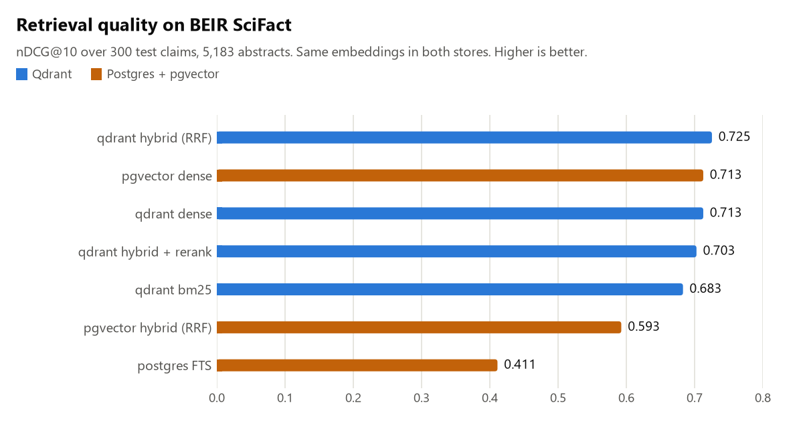
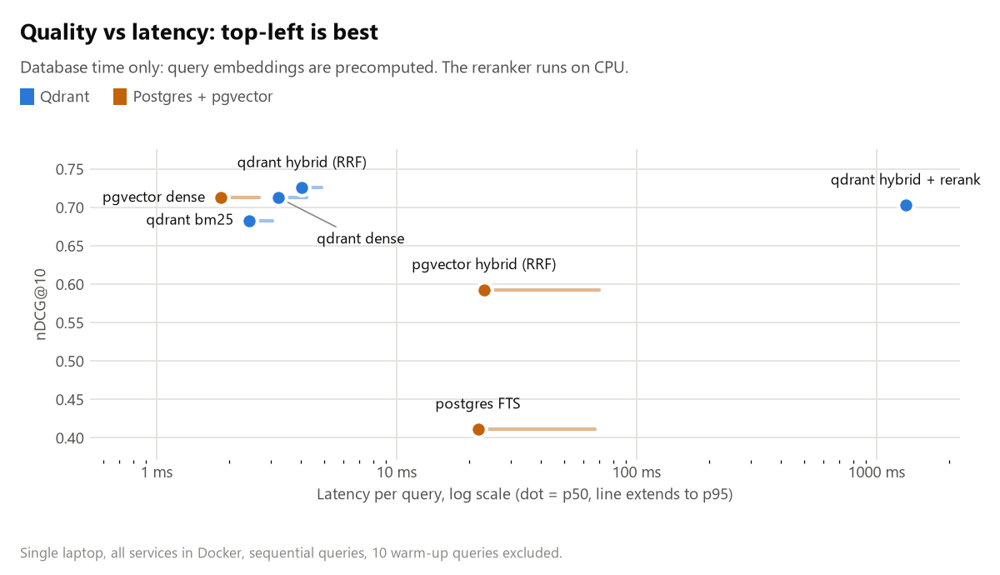

# agent-memory-lab

Two pieces of infrastructure an LLM agent needs besides the model, built and measured locally:

1. **Retrieval: Qdrant vs Postgres + pgvector** for hybrid (lexical + dense) search, benchmarked on
   BEIR SciFact with identical embeddings, identical fusion and identical HNSW settings.
2. **Memory and telemetry in MongoDB** for a LangGraph agent: checkpointed conversation state,
   long-term user memory, and one document per LLM call and tool call, with aggregation
   pipelines for cost per session and latency percentiles per tool.

Everything runs in Docker on a laptop. The benchmark makes no API calls.

## Retrieval results

5,183 abstracts, 300 test claims with relevance judgements. `bge-small-en-v1.5` dense vectors
are computed once and loaded into both stores; both hybrids fuse the top 100 from each side
with reciprocal rank fusion (k=60); both HNSW indexes search with ef=128.

<picture>
  <source media="(prefers-color-scheme: dark)" srcset="docs/charts/quality-dark.png">
  
</picture>

| Method | nDCG@10 | Recall@100 | p50 ms | p95 ms |
|---|---:|---:|---:|---:|
| **qdrant hybrid (RRF)** | **0.725** | 0.965 | 4.0 | 4.9 |
| qdrant dense | 0.713 | 0.942 | 3.2 | 4.2 |
| pgvector dense | 0.713 | 0.945 | 1.8 | 2.7 |
| pgvector hybrid (RRF) | 0.593 | 0.942 | 23.1 | 69.7 |
| qdrant hybrid + rerank | 0.703 | 0.965 | 1322.2 | 1391.1 |
| qdrant bm25 | 0.683 | 0.921 | 2.4 | 3.0 |
| postgres FTS | 0.411 | 0.761 | 21.9 | 66.9 |
| qdrant dense (exact) | 0.713 | 0.942 | 3.2 | 4.1 |
| pgvector dense (exact) | 0.713 | 0.942 | 10.7 | 12.4 |
| qdrant dense (REST) | 0.713 | 0.942 | 15.1 | 27.7 |

The last three rows are references: exact (brute-force) search in each store, and the same Qdrant
dense query over REST instead of gRPC.

<picture>
  <source media="(prefers-color-scheme: dark)" srcset="docs/charts/latency-dark.png">
  
</picture>

Latency is client-observed from Python, sequential, after 10 warm-up queries, with query
embeddings precomputed so only the database is timed.

### What the numbers say

- **The lexical side decides the hybrid.** Qdrant's sparse vectors with the IDF modifier give
  real BM25 (0.683 nDCG@10), and fusing it with dense search beats dense alone. Postgres
  full-text search (`ts_rank_cd`) has no IDF and, by default, no length normalisation; it scores 0.411, and
  fusing it in makes the result *worse* than dense alone (0.593 vs 0.713). If you want hybrid
  search on Postgres, you need a real BM25 extension (e.g. ParadeDB `pg_search`) or you should
  do the lexical side elsewhere.
- **Dense search is the same in both stores.** Same vectors, same nDCG; the approximate HNSW
  results match exact search on nDCG@10 to three decimals.
- **At this size, latency is transport, not search.** Qdrant's server-side HNSW time is about
  0.8 ms; the rest of the ~3 ms is the Python gRPC client. Over REST the same query costs
  15 ms p50. pgvector's HNSW query is ~1.8 ms end to end.
- **A reranker is not free and not automatically better.** The MS MARCO MiniLM cross-encoder
  re-scoring the top 20 *lowered* nDCG@10 (0.725 to 0.703) and added ~1.3 s per query on
  CPU. It was trained on web search queries, not scientific claims, and here it is worse than
  the first stage it reorders. The agent therefore uses plain hybrid search. A reranker has to
  earn its place on your own eval set.

### Gotchas this surfaced

- **Small collections silently skip the index.** At 5K rows the Postgres planner chose a
  sequential scan over the HNSW index (exact search, 10.7 ms), and Qdrant neither built HNSW
  (segments under `indexing_threshold`) nor used it (`full_scan_threshold`). Both are sensible
  defaults for a small corpus, but a benchmark that doesn't check `EXPLAIN` or
  `indexed_vectors_count` is measuring brute force. Here the indexes are forced
  (`enable_seqscan = off`; lowered Qdrant thresholds) and the exact rows are kept for reference.
- **`hnsw.ef_search` caps pgvector results.** The default of 40 means an HNSW query returns at
  most ~40 rows however high the `LIMIT`. It is set to 128.
- **`plainto_tsquery` ANDs every word**, so a long claim matches almost nothing. The query is
  rewritten to OR the terms.
- **Payload reads cost as much as the search.** Qdrant stores payload on disk by default;
  fetching a `doc_id` field for 100 hits roughly doubled server time. Using the integer doc id
  as the point id removed the payload read from every id-only query.

## Agent memory in MongoDB

A small research agent over SciFact (LangGraph ReAct loop, Claude Haiku 4.5 on Amazon Bedrock)
with three tools: `search_papers` (Qdrant hybrid), `remember` and `recall`.

| What | Where | Why |
|---|---|---|
| Conversation state | `checkpoints`, `checkpoint_writes` (LangGraph `MongoDBSaver`) | Resume a thread by id after a restart |
| Session metadata | `sessions` `{_id, user_id, model, started_at, turns}` | One document per session, upserted |
| LLM calls | `llm_calls` `{session_id, ts, model, input/output/cache tokens, latency_ms, cost_usd, stop_reason}` | One document per call, written by a LangChain callback |
| Tool calls | `tool_calls` `{session_id, ts, tool, args, ok, error, latency_ms, result_chars}` | Same callback; errors are logged, not lost |
| Long-term memory | `memories` `{user_id, text, session_id, created_at}` | Survives across sessions; searched by `recall` |

Design choices:

- **One document per event**, not an array pushed onto the session: writes are append-only,
  documents never approach the 16 MB limit, and every field can be grouped on.
- **Indexes follow the queries**: `(session_id, ts)` on both call collections for per-session
  reports, `(tool, ts desc)` for per-tool latency over time, `(user_id, started_at desc)` on
  sessions, and a compound `(user_id, text)` text index so `recall` is scoped to one user.
- **Cost is computed at write time** from list prices, with cached input tokens split out and
  billed at the cache-read rate. Unknown models get `cost_usd: null`, not a guess.

`report.py` runs three aggregation pipelines: per-session tokens and cost with a `$lookup` into
tool calls, per-tool call counts, errors and p50/p95 latency (`$percentile`, MongoDB 7.0+), and
per-model LLM latency.

### Demo run

`agent --demo` runs five turns for one user across three sessions. The pharmacist preference
saved in session **a** shaped the answers in **b** and **c** ("Given your background as a
pharmacist focused on human clinical evidence..."), and the follow-up in **a** ("What about in
elderly people?") was answered from the checkpointed thread. Output of `report`:

| session_id | llm_calls | input_tokens | output_tokens | cost_usd | tool_calls | llm_ms | tool_ms |
|---|---:|---:|---:|---:|---:|---:|---:|
| 82dbbc-a | 6 | 18,562 | 810 | 0.02261 | 5 | 15,375 | 79 |
| 82dbbc-b | 4 | 7,985 | 438 | 0.01018 | 2 | 8,142 | 32 |
| 82dbbc-c | 4 | 8,948 | 481 | 0.01135 | 3 | 8,440 | 50 |

| tool | calls | errors | p50_ms | p95_ms |
|---|---:|---:|---:|---:|
| search_papers | 9 | 0 | 16.4 | 25.0 |
| remember | 1 | 0 | 5.5 | 5.5 |

Claude Haiku 4.5: 14 calls, p50 1,515 ms, p95 4,622 ms.

What the telemetry showed:

- **The model is 99% of the latency.** Retrieval (query embedding on CPU plus Qdrant) is ~16 ms;
  each LLM step is ~1.5 s, and a turn takes two to four steps.
- **Input tokens are ~80% of the cost.** Every ReAct step resends the conversation and the
  retrieved abstracts; output is short. The whole demo cost $0.044.
- **Don't rely on the model to load its own memory.** The first version told the model to call
  `recall` at the start of a conversation. In the first demo run it never did, and answered
  session c without the saved preference. Saved memories are now put into the system prompt on
  every turn, and `recall` remains for searching older ones.
- **The first tool call paid a 1.4 s cold start** while the ONNX models loaded (it showed up as
  the p95). The demo now loads them before the first turn.

A logged LLM call and tool call:

```json
{"session_id": "82dbbc-a", "user_id": "demo-user", "ts": "2026-09-24T13:01:50+00:00",
 "model": "global.anthropic.claude-haiku-4-5-20251001-v1:0", "input_tokens": 813,
 "output_tokens": 113, "cache_read_tokens": 0, "latency_ms": 3285.6, "cost_usd": 0.001378,
 "stop_reason": "tool_use"}
{"session_id": "82dbbc-c", "user_id": "demo-user", "ts": "2026-09-24T13:02:16+00:00",
 "tool": "search_papers", "args": {"query": "beta blockers secondary prevention acute MI randomized controlled trial"},
 "ok": true, "latency_ms": 14.0, "error": null, "result_chars": 3568}
```

## Run it

```bash
docker compose up -d                                   # MongoDB 8, Qdrant 1.19, Postgres 17 + pgvector
uv sync
uv run python -m agent_memory_lab.bench                # ~8 min on CPU, most of it the reranker
uv run python -m agent_memory_lab.charts
uv run pytest                                          # metric tests + MongoDB tests against the container

# needs AWS credentials with Bedrock access (profile/region in agent.py)
uv run python -m agent_memory_lab.agent --demo
uv run python -m agent_memory_lab.report
```

## Layout

```
src/agent_memory_lab/
  data.py          BEIR SciFact from the Hugging Face hub
  embed.py         fastembed (ONNX, CPU): bge-small dense, BM25 sparse, MiniLM cross-encoder
  qdrant_store.py  one collection, named dense + sparse vectors, server-side RRF
  pg_store.py      pgvector HNSW + tsvector/GIN, RRF in one SQL statement
  metrics.py       nDCG@10, Recall@100, RRF, percentiles
  bench.py         the retrieval benchmark -> docs/results.json
  charts.py        README charts (light and dark)
  memory.py        MongoDB schema, indexes, logging callback, remember/recall
  agent.py         LangGraph agent with MongoDB checkpointer
  report.py        aggregation pipelines
```

## Limits

- One small corpus (5K docs). At this scale every engine is fast; the latency numbers show
  overheads, not how the engines scale to millions of vectors.
- One machine, sequential queries, no concurrency or filtering benchmarks.
- Postgres FTS is the built-in one; a BM25 extension would change the Postgres hybrid result.
